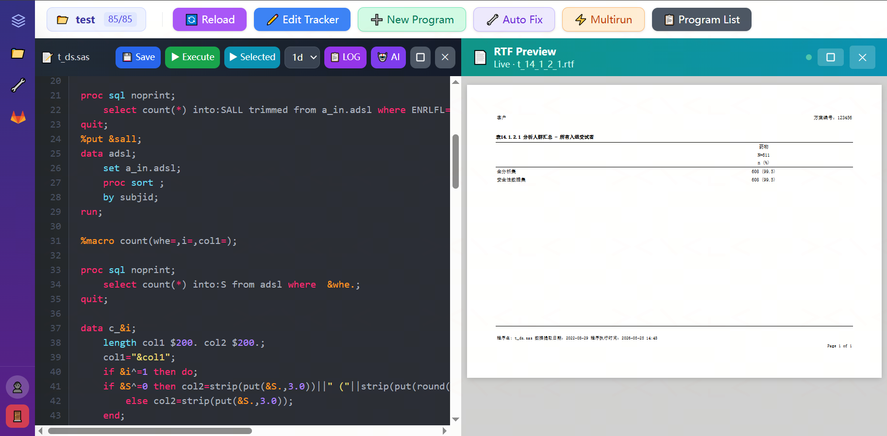

# SCE (Statistical Computing Environment)

A browser-based integrated development platform for clinical trial statistical programming, built with React and Node.js. SCE brings together program editing, SAS execution, output review, project tracking, and team collaboration into a single web interface — no local SAS installation required for end users.

---

## Why SCE?

Clinical trial programming teams typically juggle SAS EG, shared network drives, manual trackers, and disconnected QC workflows. SCE replaces this fragmented setup with a unified, browser-accessible environment that works on any machine connected to the internal network.

---

## Features

### 📋 Project & Program Management
- Load projects from a central `Tracker.xlsx` — program list, status, and metadata all in one place
- Dashboard view with completion stats across the entire project portfolio
- Filter, sort, and search programs by type, status, or filename
- New Program Wizard — create SAS files with a standard header template, auto-placed in the correct directory

### ✏️ Code Editor
- Syntax highlighting for SAS, R, and Python
- One-click SAS execution with real-time log streaming
- Save, undo/redo, and cursor-aware AI code suggestions
- Inline AI menu (✦) for context-aware completions and a floating chat window for longer questions

### 📊 Output Review
- **RTF live preview** — right panel auto-refreshes when SAS output changes
- **SAS dataset viewer** — infinite-scroll table with column filtering and variable label toggle
- **LOG viewer** — color-coded ERROR / WARNING highlighting
- All panels support maximize mode for focused review

### 🗂️ File Browser
- Recursive directory tree for browsing project folders
- Supports SAS, LOG, RTF, SAS7BDAT, Excel, PDF, R, Python files and more

### 🔧 Built-in Tools
A curated library of productivity tools accessible directly from the sidebar:

| Tool | Description |
|---|---|
| **Word2PDF** | Convert and combine RTF/Word files into a bookmarked PDF with Table of Contents |
| **DupChecker** | Detect duplicate code blocks between Main and QC SAS programs |
| **Bookmark** | Update aCRF bookmarks by VISIT and by DOMAIN |
| **DefinePageChecker** | Validate page references in Define.xml |
| **AutoGenaCRF** | Auto-generate annotated CRF |
| **AutoGenSDTM** | Auto-generate SDTM domain |
| **AutoListing** | Auto-generate listing program |
| **AutoTable** | Auto-generate table program |
| **TFLFormatter** | Format TFL fonts & sizes |
| **SDTMTrans** | Translate SDTM datasets |
| **eDT2SAS** | Convert eDT Excel file to SAS dataset |
| **FileMask** | Rename & mask sensitive information in XLSX / DOCX / PDF files |
| **GetNullVar** | Get variables whose values are all missing in a dataset |
| **SAS2TXT** | Extract Chinese keywords from SAS files / Convert SAS to TXT |
| **Shell2TOC** | Create TOC.xlsx and update Tracker.xlsx from Shell DOCX |
| **Convertor** | Convert SAS file encoding: GBK ↔ UTF-8 |
| **Startup** | Create SDTM/ADaM specifications template |

### 🔀 Multirun
- Submit multiple SAS programs in batch with a configurable execution queue and per-program status tracking

### 🔁 Version Control
- Built-in Git panel: stage, unstage, commit, pull, and push without leaving the browser
- Pre-push safety check — warns if the remote has new commits or if `Tracker.xlsx` changed remotely
- Clone repositories by URL with branch selection

---

## Tech Stack

| Layer | Technology |
|---|---|
| Frontend | React 18, Tailwind CSS, Axios |
| Backend | Node.js, Express |
| Version Control | Git / GitLab |
| SAS Execution | SAS 9.4 (server-side) |
| Real-time Preview | WebSocket |

---

## License

MIT License — see [LICENSE](LICENSE) for details.
